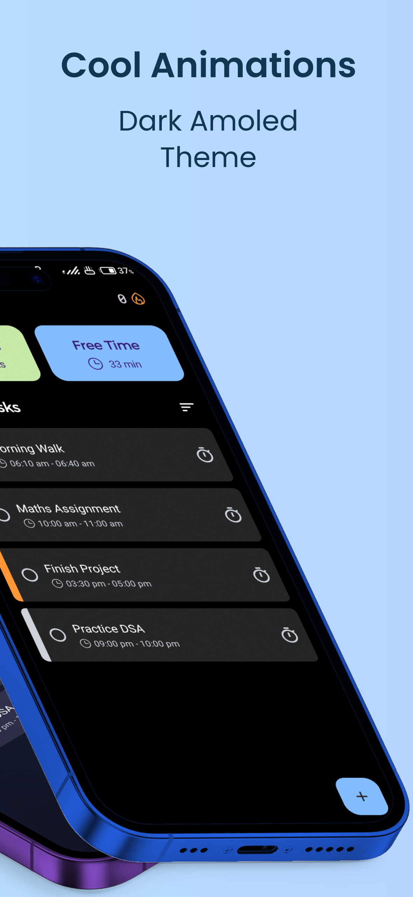
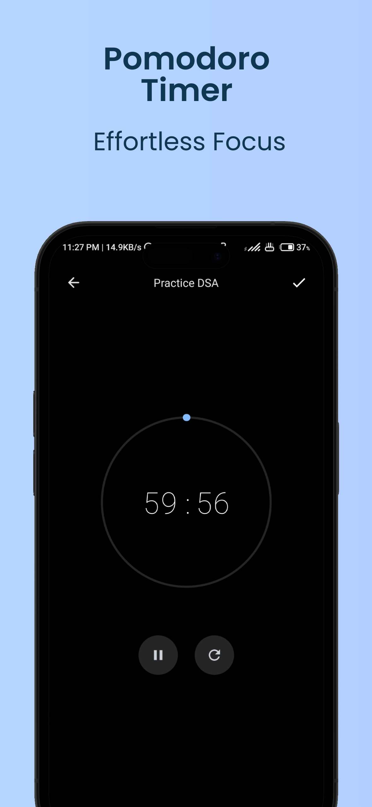
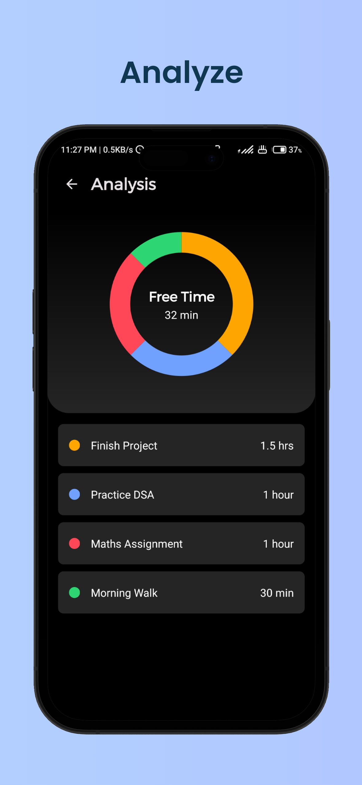

<div align="center">


# **Snaptick**

Snaptick is a free daily task planner app designed to help users increase productivity. With an easy-to-use interface and features like a pomodoro timer, users can easily organize and achieve their daily plans

<br/>

<a href="https://twitter.com/vishal2376"></a>


<br/>
<br/>

<a href='https://play.google.com/store/apps/details?id=com.vishal2376.snaptick'></a>

</div>

## Features
- Create and Edit Tasks
- Pomodoro Timer
- Manage Task Priority
- Sort Tasks
- Show Free Time
- Task Analysis
- Reminder Notifications
- Ad-Free Task Management
- Create Widgets `Coming Soon`
- Repetable Tasks `Coming Soon`
- Import/Export Your Data `Coming Soon`


## Screenshots

|  |  |  |  |
|---|---|---|---|


## Getting Started

To get started with Snaptick, simply download the app from the Google Play Store or download the source code and build it yourself.

### Prerequisites

- Android Studio
- Git

### Installing

1. Clone the repository
``` git clone https://github.com/vishal2376/snaptick.git ```
2. Open the project in Android Studio
3. Build and run the app

## Contributing

We welcome contributions from anyone interested in helping to improve Snaptick! Feel free to submit a pull request or open an issue if you notice any bugs or have suggestions for new features.


## Star History

[](https://star-history.com/#vishal2376/snaptick&Timeline)

## License

This project is licensed under the GPL v3.0 License - see the [LICENSE](LICENSE) file for details.

## Credits
App Icon created by <a href="https://www.flaticon.com/free-icons/task" title="task icons"> icon_small - Flaticon</a>
